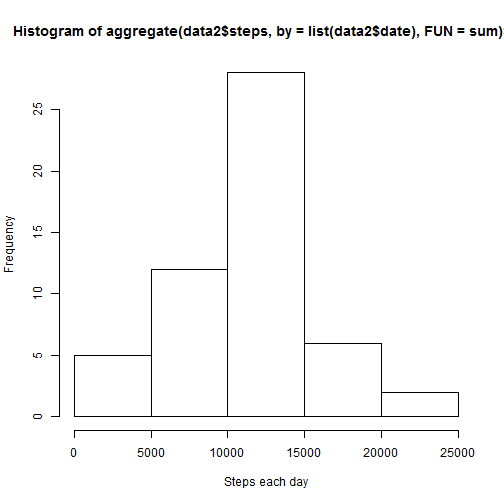
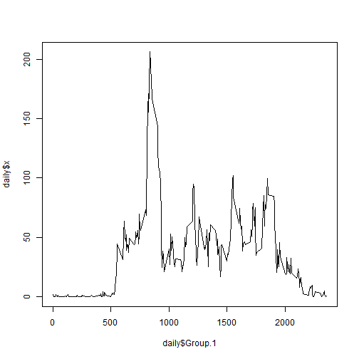
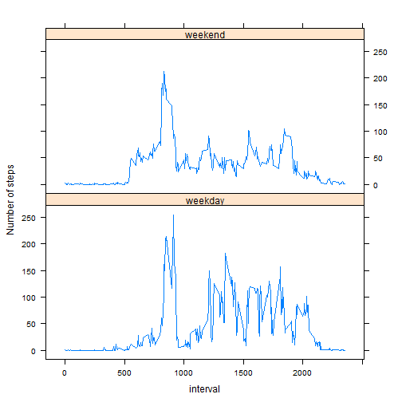

# Reproducible Research: Peer Assessment 1


## Loading and preprocessing the data

```r
data <- read.csv("activity.csv", header = TRUE, sep = ",", quote = "\"")
data$date <- as.Date(data$date, format = "%Y-%m-%d")
data2 <- data[!is.na(data$steps), ]
```


## What is mean total number of steps taken per day?

```r
hist(aggregate(data2$steps, by = list(data2$date), FUN = sum)$x, xlab = "Steps each day")
```

 

```r
mean(aggregate(data2$steps, by = list(data2$date), FUN = sum)$x)
```

```
## [1] 10766
```

```r
median(aggregate(data2$steps, by = list(data2$date), FUN = sum)$x)
```

```
## [1] 10765
```


## What is the average daily activity pattern?

```r
daily <- aggregate(data2$steps, by = list(data2$interval), FUN = mean)
plot(daily$Group.1, daily$x, type = "l")
```

 

```r
daily[which.max(daily[, 2]), ]$Group.1
```

```
## [1] 835
```


## Imputing missing values

```r
sum(is.na(data$steps))
```

```
## [1] 2304
```

```r
# i don't understand but it has som incorrect results: data4 <-
# apply(data3,1, function (x) ifelse( is.na(x[1]), daily[daily[1] ==
# x[3],2], x[3]))
data3 <- data
for (i in 1:nrow(data3)) {
    if (is.na(data3[i, 1])) {
        data3[i, 1] = daily[daily[1] == data3[i, 3], 2]
    }
}
mean(aggregate(data3$steps, by = list(data3$date), FUN = sum)$x)
```

```
## [1] 10766
```

```r
median(aggregate(data3$steps, by = list(data3$date), FUN = sum)$x)
```

```
## [1] 10766
```

```r
# meain is the same because it is filled with means median has changed
# because new values were added
```


## Are there differences in activity patterns between weekdays and weekends?

```r
data3$weekday <- as.POSIXlt(data3[, 2])$wday < 6

weekdaily <- data3[data3$weekday, ]
weekdaily <- aggregate(weekdaily$steps, by = list(weekdaily$interval), FUN = mean)

weekendly <- data3[!data3$weekday, ]
weekendly <- aggregate(weekendly$steps, by = list(weekendly$interval), FUN = mean)


par(mfrow = c(2, 1), mar = c(2, 3, 1, 1), oma = c(0, 2, 0, 0))
plot(weekendly$Group.1, weekendly$x, type = "l", ylab = "", main = "weekend", 
    col = "blue", xlab = "", xaxt = "n")
plot(weekdaily$Group.1, weekdaily$x, type = "l", ylab = "", main = "weekday", 
    col = "blue", xlab = "")
mtext("Number of steps", side = 2, outer = TRUE, font = 2)
```

 


